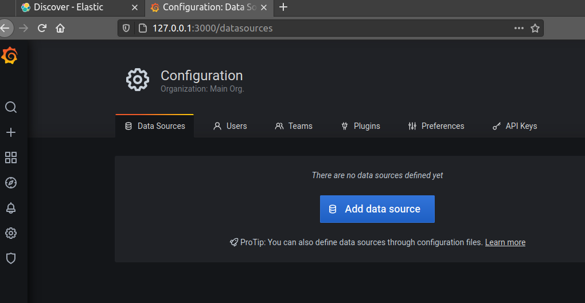
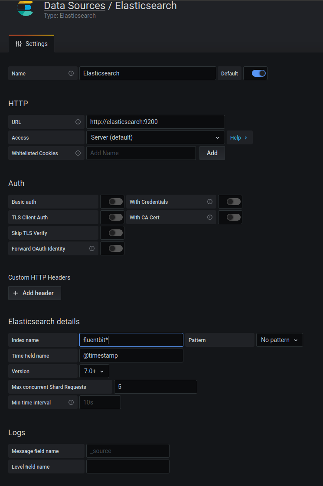

Podemos usar estas variables de entorno para sobreescribir los valores de grafana:

    GF_DEFAULT_INSTANCE_NAME=test.grafana.rafa.com

    GF_SECURITY_ADMIN_USER=rafael

    GF_SERVER_DOMAIN=test.grafana.rafa.com

Además, añadir prometheus y elastic como fuentes de datos es muy simple:
* Para Elastic:
    1. Abrimos el panel de Grafana y clicamos en la el engranaje, que el menú de configuración.

        

    2. En la lista de opciones seleccionamos Elastic, y rellenamos los campos de la siguiente manera:
        